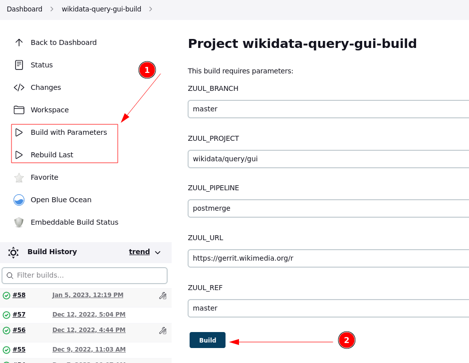

# Wikibase Query Service GUI

This repository contains the GUI for the [Wikidata Query Service](https://query.wikidata.org/).

Please see more details about the service in the [User Manual](https://www.mediawiki.org/wiki/Special:MyLanguage/Wikidata_Query_Service/User_Manual).

## Download & setup

Clone git repo, go into created folder and then pull all dependencies via npm package manager.

```bash
$ git clone https://gerrit.wikimedia.org/r/wikidata/query/gui
$ cd gui
$ npm install
```

Alternatively, use `npm install`.

```bash
npm install wikidata-query-gui
```

## Configuration
Per default the Wikibase Query Service GUI is configured to be used as a local development test instance. It can be customized by creating a `custom-config.json` in the repository's root dir. This file can be used to override any of the default settings obtained from `default-config.json`.

## Run tests

Run JSHint, JSCS and QUnit tests.

```bash
$ npm test
```

## Debug
Start a test server for local debugging. Do not use it in production.

```bash
$ npm start
```

## Build
Create a build with bundled and minified files.

```bash
$ npm run build
```


## Deploy
To deploy the GUI, [trigger a new build of the deploy repo on Jenkins](https://integration.wikimedia.org/ci/job/wikidata-query-gui-build/).



This creates a new open change in the deploy repository: https://gerrit.wikimedia.org/r/q/project:wikidata/query/gui-deploy+status:open

You can clone that repository and check out the change locally to test and verify it.

As that repository does not have any CI, you need to manually merge the change.
That means, giving +2 to both the Code Review as well as the Verified label, and then clicking the "Submit" button.

The site will be deployed with the next puppet run, which should happen after at most 30 minutes.

See also: https://wikitech.wikimedia.org/wiki/Wikidata_Query_Service#GUI_deployment_general_notes

## Components
### Editor
A [CodeMirror](https://codemirror.net/) based SPARQL editor with code completion (ctrl+space) and tooltips (hover).
```
var editor = new wikibase.queryService.ui.editor.Editor();
editor.fromTextArea( $( '.editor' )[0] );
```
See `examples/editor.html`.

### Example dialog

A dialog that allows browsing of SPARQL examples.
```
new wikibase.queryService.ui.dialog.QueryExampleDialog(  $element, querySamplesApi, callback, previewUrl );
```
See `examples/dialog.html`.

### SPARQL

```
var api = new wikibase.queryService.api.Sparql();
api.query( query ).done( function() {
	var json = JSON.parse( api.getResultAsJson() );

} );
```
See `examples/sparql.html`.
[JSFiddle.net](https://jsfiddle.net/jonaskress/qpuynfz8/)


### Result Views
Views that allow rendering SPARQL results ([see documentation](https://www.wikidata.org/wiki/Special:MyLanguage/Wikidata:SPARQL_query_service/Wikidata_Query_Help/Result_Views)).

```
var api = new wikibase.queryService.api.Sparql();
api.query( query ).done(function() {
	var result = new wikibase.queryService.ui.resultBrowser.CoordinateResultBrowser();
	result.setResult( api.getResultRawData() );
	result.draw( element );
} );
```
See `examples/result.html`.
[JSFiddle.net](https://jsfiddle.net/jonaskress/9dhv0yLp/)

### Release Notes and npm package

Unfortunately there are no releases and the provided code and interfaces are not considered to be stable.
Also the dist/ folder contains a build that may not reflect the current code on master branch.
